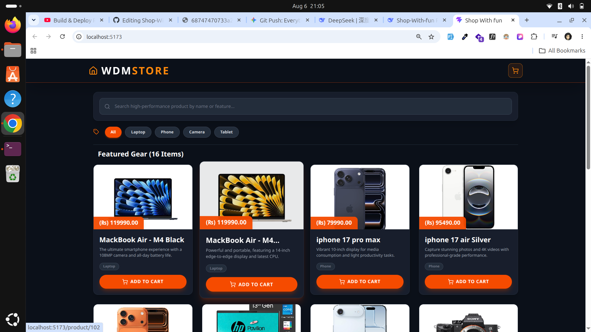
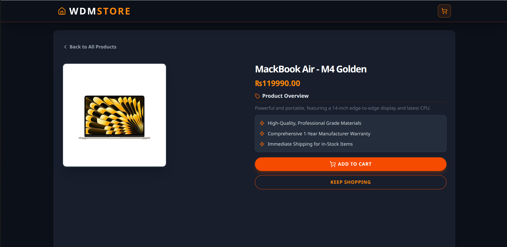
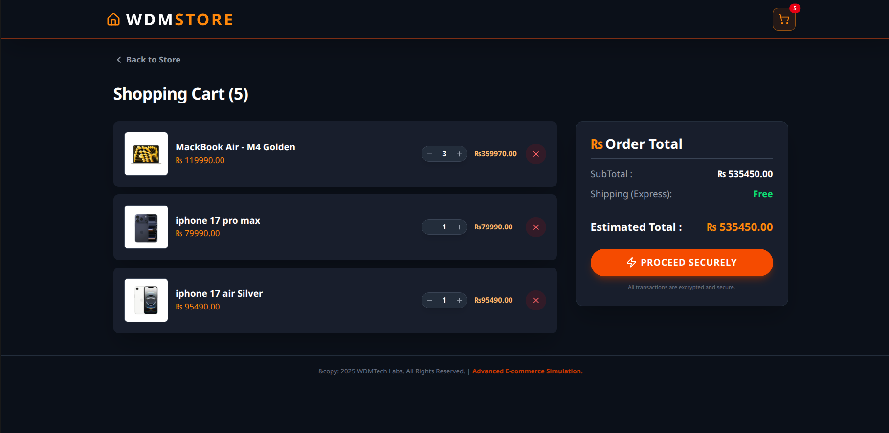
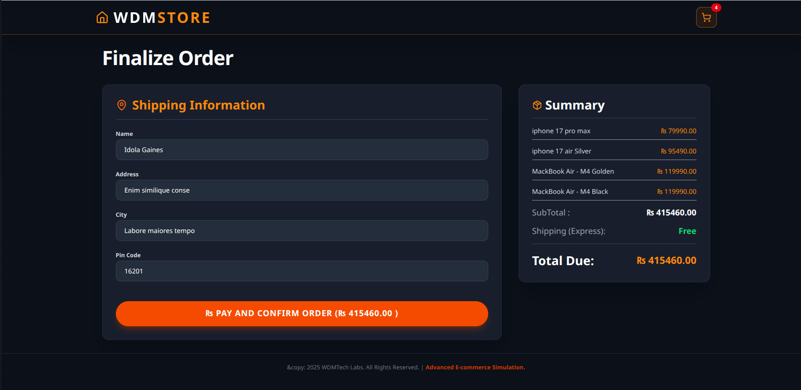
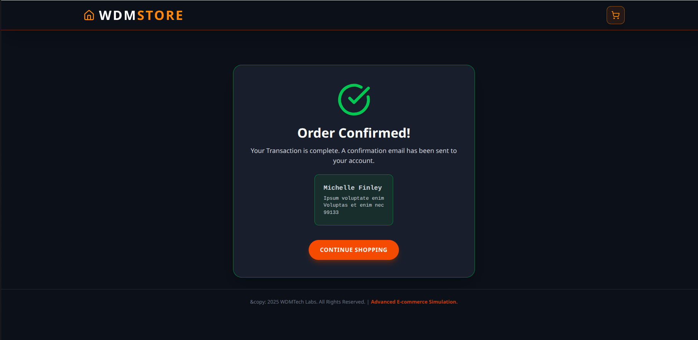
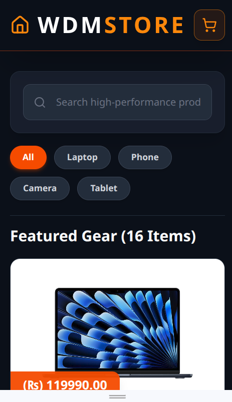

# 🛍️ Shop With Fun



A modern, feature-rich e-commerce web application built with React and Vite. Shop With Fun provides a seamless shopping experience with real-time cart management, product filtering, and a secure checkout flow.

## 📸 Screenshots

| Home Page                                        | Product Detail                                       | Cart                                             |
| ------------------------------------------------ | ---------------------------------------------------- | ------------------------------------------------ |
|  |  |  |

| Checkout                                                 | Order Confirmation                                 | Mobile View                                          |
| -------------------------------------------------------- | -------------------------------------------------- | ---------------------------------------------------- |
|  |  |  |

> **Tip:** Replace these placeholder images with actual screenshots of your project. You can take them using your browser's developer tools or a screen capture tool.

## ✨ Features

- **Product Catalog** – Browse a curated collection of products with images, prices, and descriptions
- **Search & Filter** – Search products by name/description and filter by category
- **Shopping Cart** – Add/remove items, adjust quantities, and view real-time totals
- **Cart Persistence** – Cart state managed via React Context API
- **Toast Notifications** – Instant feedback on cart actions using `react-toastify`
- **Responsive Design** – Fully responsive UI powered by **Tailwind CSS**
- **Product Details** – Dedicated page for viewing detailed product information
- **Checkout Flow** – Secure checkout process with order confirmation

## 🛠️ Tech Stack

| Technology            | Purpose                        |
| --------------------- | ------------------------------ |
| **React 19**          | UI Library                     |
| **Vite**              | Build Tool & Dev Server        |
| **Tailwind CSS**      | Styling & Utility Classes      |
| **React Router DOM**  | Client-side Routing            |
| **React Context API** | Global State Management (Cart) |
| **Lucide React**      | Icon Library                   |
| **React Toastify**    | Toast Notifications            |
| **ESLint**            | Code Linting                   |
| **Prettier**          | Code Formatting                |

## 📦 Installation & Setup

Follow these steps to run the project locally:

### Prerequisites

- Node.js (v18 or higher)
- npm or yarn

### Steps

```bash
# 1. Clone the repository
git clone https://github.com/MuhammadOwais0321/Shop-With-fun.git

# 2. Navigate to the project directory
cd Shop-With-fun

# 3. Install dependencies
npm install

# 4. Start the development server
npm run dev
```

The app will be available at `http://localhost:5173` (or the port shown in your terminal).

### Build for Production

```bash
npm run build
npm run preview
```

## 📁 Project Structure

```
Shop-With-fun/
├── public/                 # Static assets
├── src/
│   ├── components/         # Reusable UI components
│   │   ├── Navbar.jsx
│   │   ├── ProductCard.jsx
│   │   ├── Cartitem.jsx
│   │   ├── CategoryFilter.jsx
│   │   ├── SearchFilter.jsx
│   │   ├── Footer.jsx
│   │   └── Loading.jsx
│   ├── pages/              # Page-level components
│   │   ├── ProductList.jsx
│   │   ├── ProductDetail.jsx
│   │   ├── Cart.jsx
│   │   ├── Checkout.jsx
│   │   └── OrderConfermation.jsx
│   ├── context/            # React Context providers
│   │   └── CartContext.jsx
│   ├── data/               # Static product data
│   │   └── Product.js
│   ├── App.jsx             # Main App component with routing
│   ├── main.jsx            # Application entry point
│   └── index.css           # Global styles (Tailwind)
├── .gitignore
├── .prettierrc
├── package.json
├── vite.config.js
└── README.md
```

## 🧠 How It Works

### Cart Management

The cart state is managed via the `CartContext` provider, which exposes:

- `cart` – Array of items in the cart
- `addToCart(product)` – Adds a product or increments quantity
- `removeFromCart(productId, removeAll)` – Decrements quantity or removes entirely
- `clearCart()` – Empties the cart
- `cartCount` – Total number of items
- `cartTotal` – Total price of all items

### Routing

The app uses React Router for navigation with the following routes:

- `/` – Product listing (homepage)
- `/product/:id` – Product details
- `/cart` – Shopping cart
- `/checkout` – Checkout page
- `/order-confirmation` – Order confirmation

### Styling

All components are styled using **Tailwind CSS** with utility-first classes for a clean, modern look.

## 📄 License

This project is open source and available under the **MIT License**.

## 🙏 Acknowledgments

- [Vite](https://vitejs.dev/) – Next-gen frontend tooling
- [React](https://react.dev/) – UI library
- [Tailwind CSS](https://tailwindcss.com/) – Utility-first CSS framework
- [Lucide Icons](https://lucide.dev/) – Beautiful open-source icons
- [React Toastify](https://fkhadra.github.io/react-toastify/) – Toast notifications
